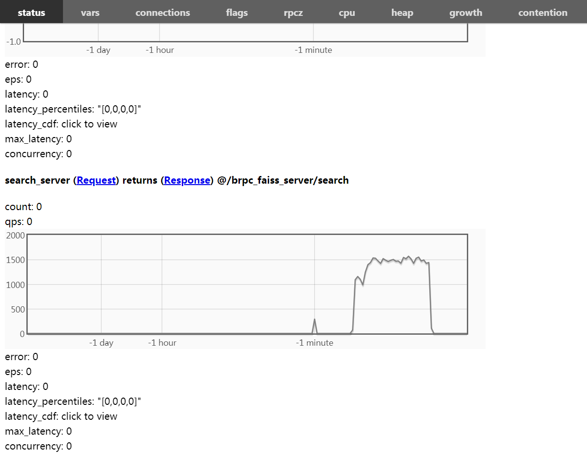

# 基于 brpc + faiss 的矢量检索框架


## 概述
矢量检索，顾名思义，就是通过固定维度的浮点数矢量，在数据库里查找与之距离最近的 top-k 个矢量的过程，在深度学习领域是一个非常常见，而且非常实用的基础组件，在视频检索，文本召回，人脸识别验证，推荐系统等问题均有很多应用。

这里，我们提供一个阉割版的矢量检索服务框架，性能并不高，主要用于教学目的，不过可以基于此框架升级到比较实用的状态。

阉割版目前的特性包括，都是非常简单的实现：

1. 一定程度上支持并发的增删改查过程
2. 支持简单的 online 方式构建索引，支持并发构建索引
3. 支持简单的持久化方案
4. 提供较为丰富，且利于扩充的接口形式(主要是 BRPC 功劳)
5. 提供一些简单的并发测试脚本


## 启动服务

>  确保系统安装有 docker，并保证在代码的根目录下运行如下命令：

1. 构建镜像
```bash
TARGET=brpc_faiss_server:v1
nvidia-docker build -t ${TARGET} ./
```

2. 启动镜像，比如我们设置端口为 8330，需要将 src/config.h 里面的 IP_PORT 修改为 8330，数据缓存位置设置为 tmp，如有需要可以换到你想要的任意目录下
```bash
SERVER_TMP_DIR=/absolute/path/to/your/tmp/dir
mkdir ${SERVER_TMP_DIR}
nvidia-docker run -itd --name brpc_faiss_server \
-v ${SERVER_TMP_DIR}:/data/saved_rocksdb_faiss \
-v `pwd`/:opt/brpc_server \
-p 8330:8330 ${TARGET} /bin/bash
```

3. 启动服务

```bash
nvidia-docker exec -it brpc_faiss_server /bin/bash
cd /opt/brpc_server && ln -s ../third_party ./ && sh start.sh
exit
```


## 使用服务

1. 获取 docker 的宿主机 ip 地址 xx.xxx.x.xxx，也就是服务地址
2. 内部提供 protobuf 的接口，不过为了方便展示，这里用 http 方式调度
3. python 可以直接使用 request 模块进行 http 方式调度服务，也可以使用 curl 命令访问
4. 服务监控面板，可以在浏览器打开 http://xx.xxx.x.xxx:8330/status ，进行监控，这里的  xx.xxx.x.xxx  就是宿主机 ip


提供了 6 个服务，每个服务的 url 为：

> 创建一个检索数据库： http://xx.xxx.x.xxx:8330/brpc_faiss_server/create
>
> 批量添加数据：http://xx.xxx.x.xxx:8330/brpc_faiss_server/batch_add
>
> 删除数据库：http://xx.xxx.x.xxx:8330/brpc_faiss_server/delete
>
> 查询数据库状态：http://xx.xxx.x.xxx:8330/brpc_faiss_server/status
>
> 从指定位置，恢复数据库：http://xx.xxx.x.xxx:8330/brpc_faiss_server/restore
>
> 进行矢量检索：http://xx.xxx.x.xxx:8330/brpc_faiss_server/search


增加一个库：

```python
import requests
url = " http://xx.xxx.x.xxx:8330/brpc_faiss_server/create"
request_data = {
	"db_name": "word.emb",
	"feature_dim": 200,
	"feature_version": "v1",
	"search_type": 0,
	"similarity_type": "L2",
	"search_device": "cpu",
}
request_data = json.dumps(request_data)
result = requests.post(url=url, data=request_data)
```


查询服务状态：

```python
import requests
url = " http://xx.xxx.x.xxx:8330/brpc_faiss_server/status"
request_data = {
	"db_name": "word.emb",
}
request_data = json.dumps(request_data)
result = requests.post(url=url, data=request_data)
```


删除某个库：

```python
import requests
url = " http://xx.xxx.x.xxx:8330/brpc_faiss_server/delete"
request_data = {
	"db_name": "word.emb"
}
request_data = json.dumps(request_data)
result = requests.post(url=url, data=request_data)
```


批量添加：

```python
import requests
url = " http://xx.xxx.x.xxx:8330/brpc_faiss_server/batch_add"
data = []
for cid, fid, feature in list(zip(cids, fids, features)):
	item = {"cid": cid, "feature_id": fid, "b64_feature": feature}
	data.append(item)

request_data = {
	"db_name": "word.emb",
	"feature_version": "v1",
	"feature_dim": 200,
	"data": data,
}

request_data = json.dumps(request_data)
result = requests.post(url=url, data=request_data)
```


矢量检索：

```python
import requests
url = " http://xx.xxx.x.xxx:8330/brpc_faiss_server/search"
request_data = {
	"db_name": "word.emb",
    "b64_feature": "NxxWPhZuKb4Iym29TfaPPjro0j2Yh8w9A7BBPfGC6D0drE8+6kB2P...",
    "topk": 10,
}
request_data = json.dumps(request_data)
result = requests.post(url=url, data=request_data)
```


## 并发测试

这里只是提供简单的 python 接口做并发测试，机器： 32 核 cpu 机器


首先安装的 python 库，其中 Locust 库是并发压测工具，可以依靠单机多核，轻松形成几万的 QPS：

```python
pip install requests, Locust, numpy
```


在根目录运行如下命令，实现通过服务初始化数据库：

```bash
cd python/test_concurrent
IP=xx.xxx.x.xxx # 服务宿主机的ip
PORT=8330 # 服务宿主机的端口
python config.py --ip ${IP} --port ${PORT} --size 100000 # size 是需要填充的数据条数
```

 接着我们测试 ```search``` 过程的 QPS，可以接着运行：

```bash
run.sh ${IP} ${PORT} search.py
```

如果我们要测试 ```状态查询``` 过程的 QPS，可以接着运行： 

```bash
run.sh ${IP} ${PORT} status.py
```


在压测过程，在浏览器打开 http://xx.xxx.x.xxx:8330/status ，就可以查看性能面板，非常方便：



阉割版本的检索服务压测结果，召回 top-10，测试得到的结果如下：

1. 10 万数据，200 维，OMP_NUM_THREADS=8，采取 Faiss 最基本的暴力搜索 IndexFlatL2，并发只有 1500 qps 左右
2. 100 万数据，200 维，OMP_NUM_THREADS=1，采取 Faiss 最基本的暴力搜索 IndexFlatL2，并发只有 60 qps 左右


## 缺陷以及改进需求

工程上的改进：

1. 理论上来说，对于 faiss，百万级别数据，单核检索能够轻松应对 500 QPS，32核机器，理论上能够接近万量级的并发能力，阉割版本的检索并发效果非常差，如何改进？
2. 阉割版读写部分的锁机制，粒度太粗，后期要细化
3. 阉割版已经编译好 GPU 模式下的 faiss ，但是并没有提供 GPU 下的检索，而且 GPU 下的线程安全问题待考虑
4. 阉割版只能跑单机模式，没法支持多机模式，比如多机的宕机数据恢复，因为目前 faiss 的 index 是实现在 RAM 里面的，宕机以后，不同机器之间的数据如何自动同步，faiss 的索引如何重新构建等都是问题
5. 数据持久化过程依靠 rockdb 写到硬盘当中，但是该过程是单向的，也就是说内存会及时同步到硬盘，但是硬盘内容只能靠手动命令恢复到内存


算法上的改进需求：

1. 并发的写入索引，以及流式更新索引：faiss 本身设置并不支持该种模式，多数为离线构建好索引以后，才执行索引的加载过程，所以，如何实现动态索引的构建，这涉及到 online clustering + 重新构建 faiss 的倒排分桶机制，如何实现
2. 索引热度更新：索引对应的特征需要频繁更新，比如我们换了一个神经网络，特征变了，我们应该如何更换新的索引，由于 faiss 本身索引的构建需要 train，索引更新就不能做成实时的，如何通过在线 train，实现实时更新
3. 局部检索能力：比如我们得到一个句子的表征矢量，通常情况下，先验上，我们还可能知道该句子属于某种类别，这时候，我们更加希望矢量检索是在同类别语料库里面进行检索，如何实现
4. 内部实时聚类：有时候我们还希望一个检索服务内部自带无监督，半监督聚类能力，用于无人值守下的数据入库，自动打标等问题，如何实现